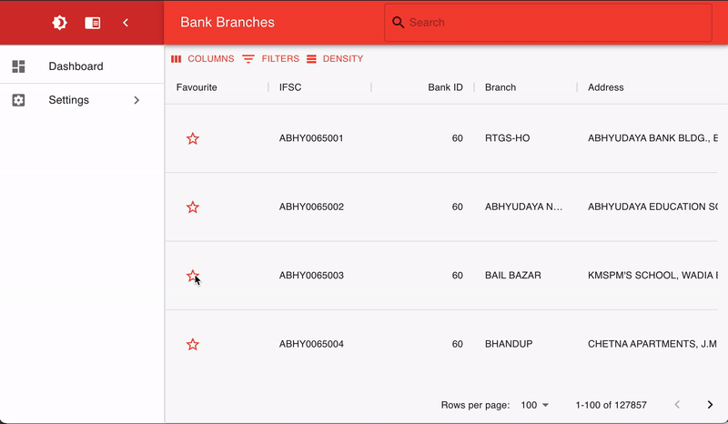
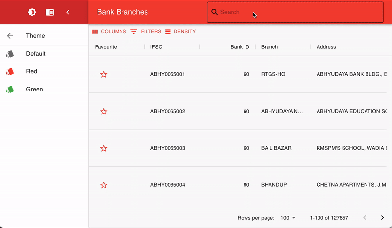
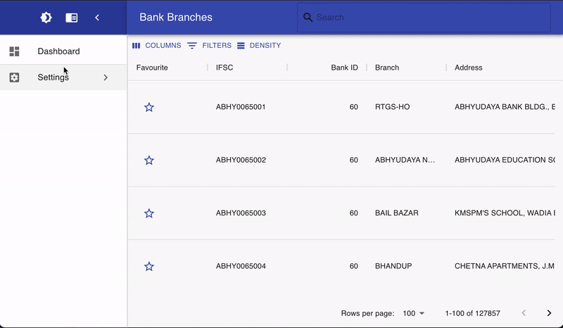

## Introduction

This project has been created in React.js using the [React Most Wanted](https://github.com/TarikHuber/react-most-wanted) template engine based on [Material UI design](https://material-ui.com/).

## Getting Started

### Installation steps

The project is preconfigured with a [backend server](https://github.com/AdityaVJ/FyleAssignmentBackend) and can be run locally in a few simple steps listed below:

- Clone the repo on local machine and run `npm install` and wait for the dependencies to be installed.

- Run `npm run dev` to run the development build of the project. Running the development build will give you access to the dev logs which includes warnings and errors.

- To run the production build, you need to first run `npm run build` to build the project and then start it by executing the `npm start` command. The production build will be an optimized version of the app and will not show debug messages on the console.

Alternatively, you can follow the steps provided in the [backend server repository](https://github.com/AdityaVJ/FyleAssignmentBackend) if you want to run the backend server on your local machine.

### System components Structure
Let's explain first the system structure to understand its components:
```
fyle-assignment-frontend --> Parent folder. 
|- public --> Contains a tweakable HTML file which can be modified to set page title and other similar properties.
|- src --> Contains pages and other components of the project.
|- config --> All system configuration files
  |- locales --> Provision for adding support for multiple languages. Currenly supports English only.
|- pages --> Contains dashboard and other pages of the app.
```
The web app has been deployed to heroku on the URL: https://fyle-assignment-frontend.herokuapp.com/

Since the app has been deployed on a free dyno plan, it sleeps after 30 minutes of inactivity. Please allow it some time for the first page load. The subsequent page loads will take less time.

### Demos





